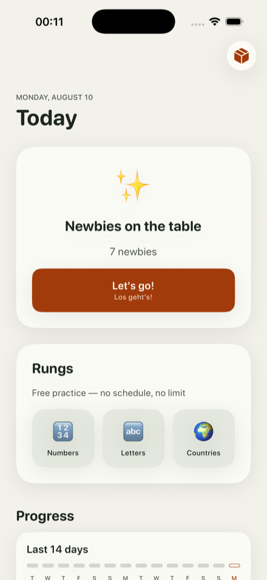
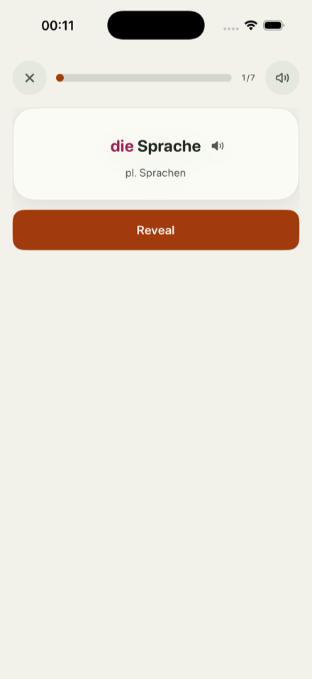
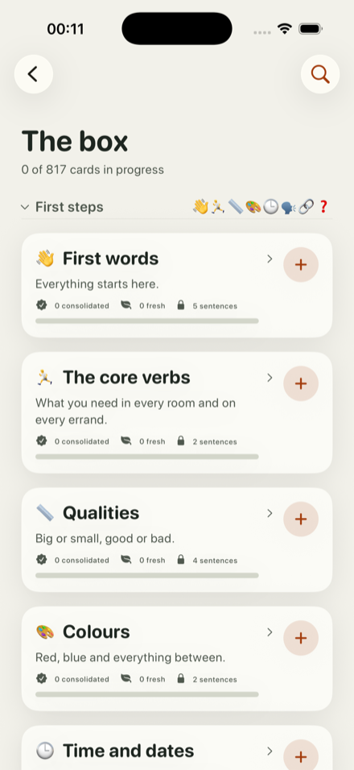
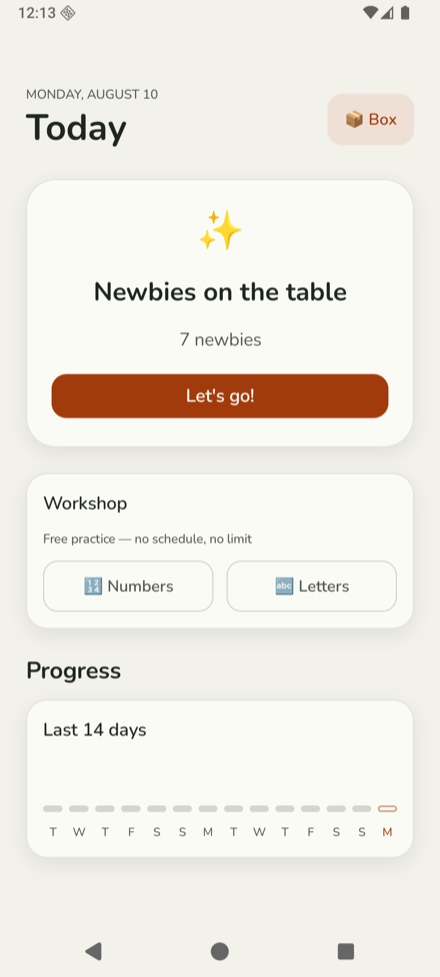
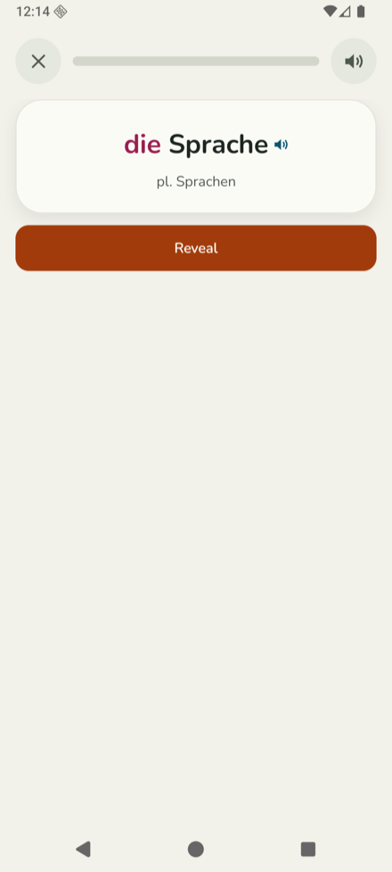
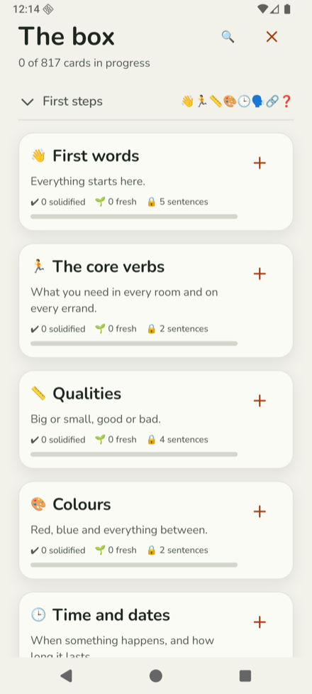

# Spross

A personal "growing box" vocabulary app:
pick the language you know (source) and the one you learn (target)
from the in-repo catalog (Deutsch · English · Kiswahili · Українська).
Native iOS (SwiftUI, iOS 17+) + watchOS companion, fully offline,
plus an Android core-loop app (Jetpack Compose) on the same engine.

The box only grows while your material sits:
each round offers a round's worth of new cards and nothing throttles that but the round,
phrases unlock once their component words are stable,
and everything is scheduled by a golden-vector-tested FSRS-6 engine.
Each card keeps ONE memory — reviews alternate between typed production
and self-graded recognition of the same schedule.

## What it looks like

One engine, one palette, two native surfaces — the same word on both,
because both asked the same box for it.

| | Today | A card | The box |
|---|---|---|---|
| **iOS** |  |  |  |
| **Android** |  |  |  |

The rungs match now too: Numbers, Letters and Countries stand on both
phones, each run on kern's rules — what still parts the platforms is listed
in `docs/design.md`.

## Install

Neither store is involved.
How a build is cut, signed and published is `docs/distribution.md`.

**Android.**
Add `https://github.com/polygongmbh/spross` in [Obtainium](https://obtainium.imranr.dev/)
and every release from here on is offered as it appears —
the app opens that door itself, on the version printed at the foot of the box.
Obtainium installs from
[`app-release.apk`](https://github.com/ImranR98/Obtainium/releases/latest/download/app-release.apk),
its universal build.
Without it, `spross-<version>.apk` from the
[latest release](https://github.com/polygongmbh/spross/releases/latest)
is the same file, installed by hand and updated the same way.

**iPhone.**
Registered test devices only, and updates arrive as new builds rather than in place.
Each release carries an `itms-services://` link to open in Safari **on the device**;
internal TestFlight testers get the same build minutes after the tag, without review.

## Structure

- `kern/` — **SprossKern**, the Kotlin Multiplatform core (`net.spross.kern`):
  domain model, catalog join, FSRS-6, box engine, session composer,
  answer normalizer, trainers, snapshot builders, store facade.
  Pure logic, time injected (`nowEpochMillis`/`tzId`), fully unit-tested.
  Engine contract: `kern/README.md`.
- `App/` — SwiftUI app: design system (poster-derived theme), file-backed store
  (one document per target language), screens (Heute / Box / Fortschritt).
  The only target that links the Kotlin framework.
- `Shared/`, `Watch/`, `Widgets/`, `WatchWidgets/` — decode-only Swift surfaces
  reading phone-built snapshots; no Kotlin linkage.
- `android/` — Jetpack Compose app (core loop: onboarding, Heute, sessions)
  on the same engine; catalog bundled by a Gradle sync task.
- `catalog/` — the in-repo content catalog (format spec: `catalog/README.md`);
  bundled as a folder resource.
- `docs/design.md` — the app-layer build contract; read before changing behavior.

## Build

```sh
brew install xcodegen        # once
scripts/bootstrap.sh         # fresh clone: JDK check, first SprossKern framework, xcodegen
xcodebuild -project Spross.xcodeproj -scheme Spross \
  -destination 'platform=iOS Simulator,name=iPhone 17 Pro' build
```

Tests (the fast gate): `./gradlew :kern:jvmTest`

## Run it

```sh
scripts/run-sim.sh                        # build, install, launch on iPhone 17 Pro
scripts/run-sim.sh --no-build             # reinstall the last build
scripts/run-sim.sh --clean                # uninstall first, so onboarding runs
scripts/run-sim.sh --device 'iPhone 16'   # another simulator, by name
scripts/run-sim.sh --shot /tmp/heute.png  # screenshot once it has drawn
scripts/run-sim.sh -- -uitest-source de -uitest-target sw   # skip onboarding
```

Arguments after `--` reach the app: `-uitest-source`/`-uitest-target` pick a
language pair, `-uitest-screen box` opens the Box, `-uitest-autostart 1` starts
the session, `-uitest-trainer numbers|letters` opens a trainer overview
(DEBUG only, read in `AppModel.start()`), and `-uitest-run 1` starts the run
from it.

Physical devices: `scripts/deploy-devices.sh` — Release, or `--debug` while iterating.

Android builds Mac-free — commands, SDK setup, emulator, install steps: `RUNBOOK-android.md`.
`scripts/run-emu.sh` is the emulator counterpart of `run-sim.sh`.

Framework mechanism: a pre-build phase stages `SprossKern.framework`
via `scripts/build-kern.sh` (integration detail: `kern/docs/build.md`).
After adding/removing Swift source files: `xcodegen generate`.
