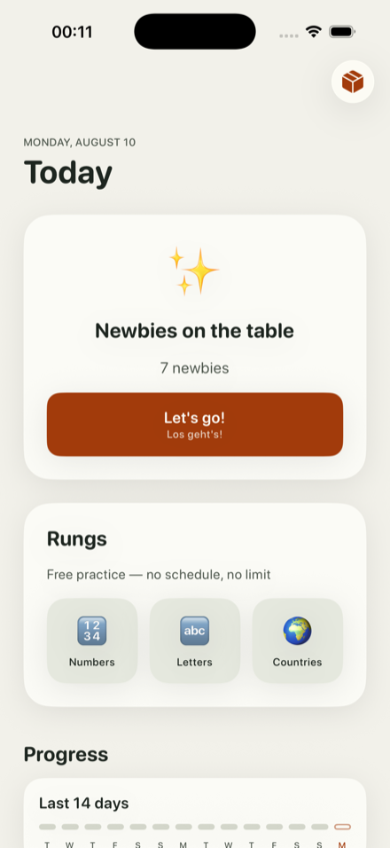
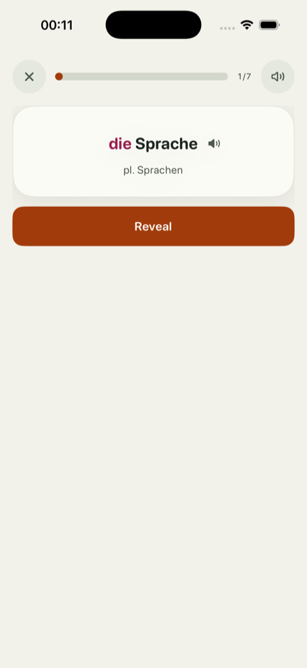
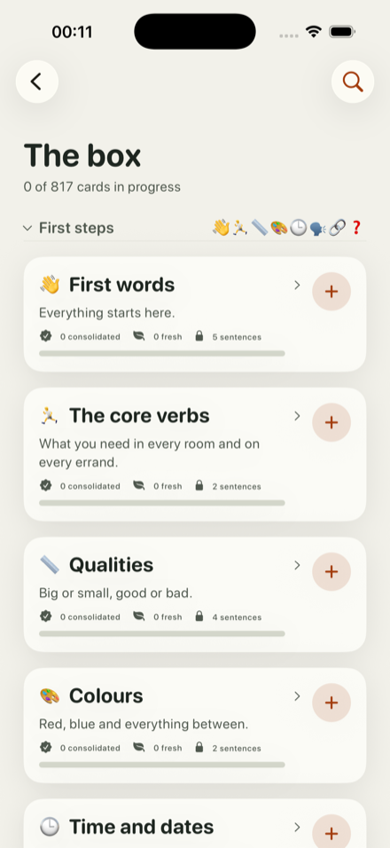
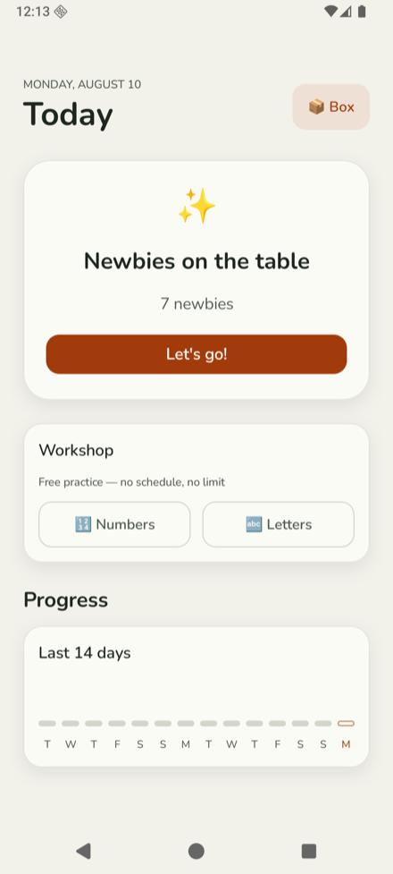
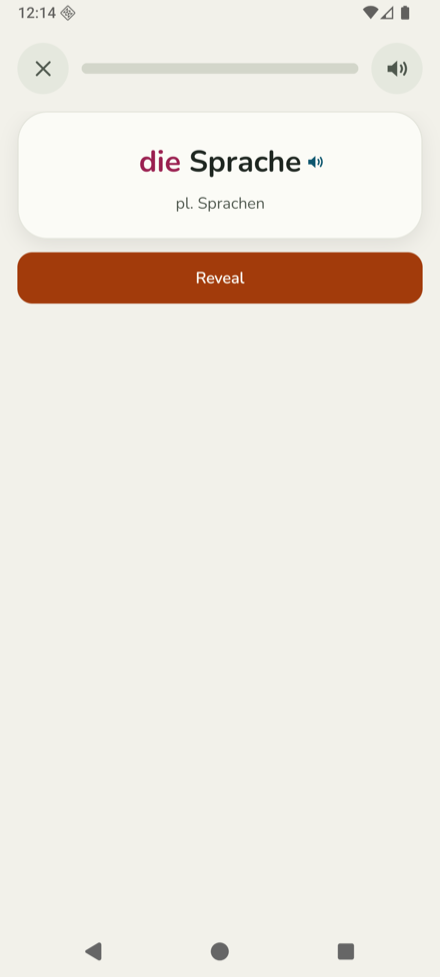
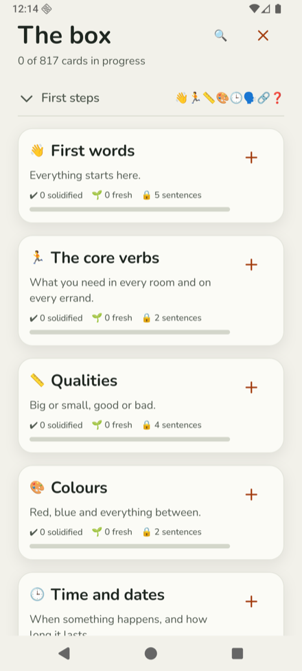

# Spross
What Spross is, how to build and run it, and where each part is documented; the rules themselves live in `docs/` and `kern/`.

A personal "growing box" vocabulary app:
pick the language you know (source) and the one you learn (target)
from the in-repo catalog (eight languages, declared in `catalog/languages.json`).
Native iOS (SwiftUI, iOS 17+) + watchOS companion, fully offline,
plus an Android app (Jetpack Compose) on the same engine.

The box only grows while your material sits:
each round offers a round's worth of new cards and nothing throttles that but the round,
phrases unlock once their component words are stable,
and everything is scheduled by a golden-vector-tested FSRS-6 engine.
Each card keeps ONE memory — reviews alternate between typed production
and self-graded recognition of the same schedule.

## What it looks like

One engine, one palette, two native surfaces — the same word on both,
because both asked the same box for it.

| | Today | A card | The box |
|---|---|---|---|
| **iOS** |  |  |  |
| **Android** |  |  |  |

The drills stand on both phones too, each run on kern's rules.

## Install

Spross is not yet published to the Stores, so it needs to be sideloaded.
How a build is cut, signed and published is `docs/distribution.md`.

**Android** — [**Add Spross to Obtainium**](https://apps.obtainium.imranr.dev/redirect?r=obtainium://add/https%3A%2F%2Fgithub.com%2Fpolygongmbh%2Fspross),
opened **on the phone**.
[Obtainium](https://obtainium.imranr.dev/) watches a repo's releases and installs them,
so with it already there the link opens its Add-App screen on this repo, ready to confirm;
without it, the same page offers Obtainium's own download
([`app-release.apk`](https://github.com/ImranR98/Obtainium/releases/latest/download/app-release.apk)
is the universal build).
Every release from here on is then offered as it appears,
and the version printed at the foot of the box opens the same link from inside the app.

Neither of those is required:
`spross-<version>.apk` from the
[latest release](https://github.com/polygongmbh/spross/releases/latest)
is the same file, installed by hand and updated the same way.

**iPhone.**
Registered test devices only, and updates arrive as new builds rather than in place.
Each release carries an `itms-services://` link to open in Safari **on the device**;
internal TestFlight testers get the same build minutes after the tag, without review.

## Structure

- `kern/` — **SprossKern**, the Kotlin Multiplatform core (`net.spross.kern`):
  domain model, catalog join, FSRS-6, box engine, session composer,
  answer normalizer, trainers, snapshot builders, store facade.
  Pure logic, time injected (`nowEpochMillis`/`tzId`), fully unit-tested.
  Engine contract: `kern/README.md`.
- `App/` — SwiftUI app: design system (poster-derived theme), file-backed store
  (one document per target language), screens (Home, Box and Settings as tabs;
  sessions and drills open over them).
  The only target that links the Kotlin framework.
- `Shared/`, `Watch/`, `Widgets/`, `WatchWidgets/` — decode-only Swift surfaces
  reading phone-built snapshots; no Kotlin linkage.
- `android/` — Jetpack Compose app on the same engine;
  catalog bundled by a Gradle sync task.
- `catalog/` — the in-repo content catalog (format spec: `catalog/README.md`);
  bundled as a folder resource.
- `docs/design.md` — the app-layer build contract; read before changing behavior.

## Build

```sh
brew install xcodegen        # once
scripts/bootstrap.sh         # fresh clone: JDK check, first SprossKern framework, xcodegen, git hooks
xcodebuild -project Spross.xcodeproj -scheme Spross \
  -destination 'platform=iOS Simulator,name=iPhone 17' build
```

Tests (the fast gate): `./gradlew :kern:jvmTest`

## Run it

`scripts/run-sim.sh` builds, installs and launches on the iPhone 17 simulator;
its header lists the flags and the DEBUG launch arguments.

Physical devices: `scripts/deploy-devices.sh` — Release, or `--debug` while iterating.

Android builds Mac-free — commands, SDK setup, emulator, install steps: `RUNBOOK-android.md`.
`scripts/run-emu.sh` is the emulator counterpart of `run-sim.sh`.

Framework mechanism: a pre-build phase stages `SprossKern.framework`
via `scripts/build-kern.sh` (integration detail: `kern/docs/build.md`).
After adding/removing Swift source files or switching commits: `scripts/gen.sh` (`run-sim.sh` runs it on every build).
